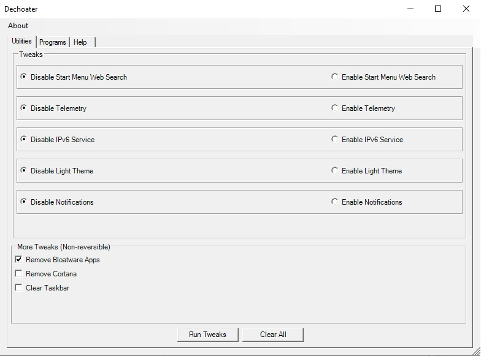
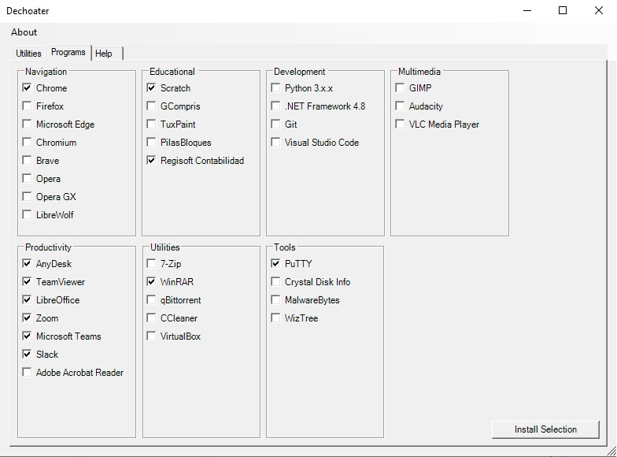

[🇦🇷 Leer en Español]()

# Dechoater 
[](https://microsoft.com/PowerShell) 

This utility combines a bunch of small tweaks with the ability to install some programs in an automatic way through the [Chocolatey](https://chocolatey.org/) package manager. <br/> 
The intention of this project is to provide users with a toolset for tweaking and optimizing their Windows 10 to their liking mostly by removing useless programs and features Microsoft bakes into fresh Windows installs.<br><br>
**This utility requires internet connection.**

## Examples
|         Tweaks          |         Programs          |
| :--------------------:  | :-----------------------: |
|  |  |


## Usage
1. Search and open a new **Windows PowerShell** with administrator privileges.<br> This can be done in any of these ways: 
    - By right-clicking the icon and selecting *Open as Administrator*
    - By pressing ```Ctrl+Alt+Enter``` when the **Windows PowerShell** icon shows up in the search box.
2. Paste the following text into the **Windows PowerShell** window and press the ```Enter``` key.
```
irm https://raw.githubusercontent.com/nicobucodiguito/dechoater/master/dechoater.ps1 | iex
```
3. A window like the ones shown in the **Examples** section should pop up after a few seconds.

## Overview
- **Tweaks**
    - **Reversible**

        - **Disable/Enable Start Menu Web Search**: Turns on/off the Bing search for the Start Menu.<br>
        *Default Windows 10 behaviour is turned on.*

        - **Disable Telemetry**: Turns on/off telemetry related registry keys and services, trying to reduce the amount of data collected by Microsoft.<br>
        *Default Windows 10 behaviour is turned on*

        - **Disable IPv6 Service**: Turns on/off IPv6 related services with the intention of reducing background processes. Shouldn't affect typical network connections.<br>
        *Default Windows 10 behaviour is turned on*

        - **Disable Light Theme**: Turns on/off Light Theme and replaces it with Dark Mode.<br>
        *Default Windows 10 behaviour is turned on*

        - **Disable Notifications**: Turns on/off the Notification panel in the task bar.<br>
        *Default Windows 10 behaviour is turned on*

    - **Non-reversible**: As the name suggests, these tweaks are mostly non-reversible by the program itself and user must be aware of this. 
        - **Remove Bloatware Apps**: Removes a fixed list of non system critical Windows programs. Tries to target mostly useless programs for the typical user.<br>
        *These apps may be reinstalled manually*
        
        - **Remove Cortana**: Modifies Cortana-related registry keys and tries to uninstall Cortana as a program.<br>
        *Cortana may be reinstalled manually*

        - **Clear Taskbar**: Modifies registry keys related to stock task bar programs in an attempt to remove useless icons from it.<br>
        *The icons and widgets removed may be re-added manually*
- **Programs**
    - **Navigation**: Web Browsers.
    - **Educational**: Programs with educational purposes.
    - **Development**: Some development related tools, languages, IDEs, etc.
    - **Multimedia**: A few programs that may be useful for watching/listening media and to also create some.
    - **Productivity**: Programs typically used in work/professional enviroments.
    - **Utilities**: Utilities for files, torrents and VMs.
    - **Tools**: Some tools that may be useful for networking and diagnosing PCs.

## Notes
For this utility to be able to run directly from the web, everything has been bundled into a single ```.ps1``` file, although this makes the code kind of hard to read and understand, it's the most effective way I've found for this to work properly needing only one command.

GUI was created with Visual Studio 2022 and translated into ```.ps1``` using [LaurentDardenne](https://github.com/LaurentDardenne)'s [ConvertForm](https://github.com/LaurentDardenne/ConvertForm) PowerShell module.

## Contribute to this project
If you've got any questions or suggestions feel free to contact me or submit an issue! :)
