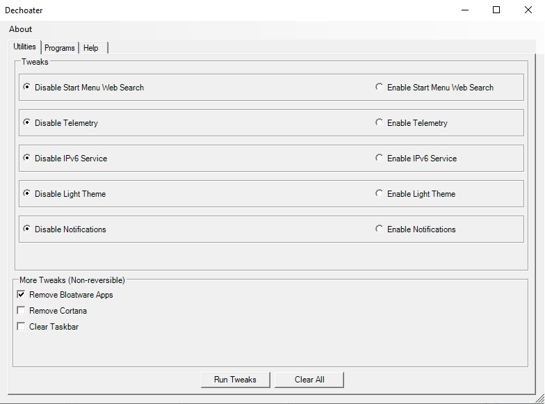
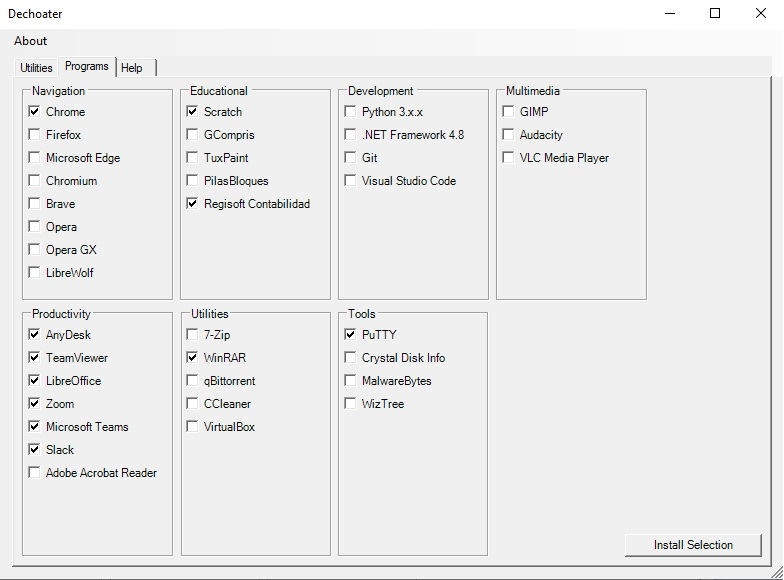

[🇺🇸 Read in english](https://github.com/nicobucodiguito/dechoater/blob/main/README.md)
# Dechoater 
[](https://microsoft.com/PowerShell) 

Esta utilidad combina pequeñas modificaciones de Windows con la habilidad de instalar programas de una manera automática a través del gestor de paquetes [Chocolatey](https://chocolatey.org/). <br/> 
La intención de este proyecto es proveer a los usuarios/as con un set de herramientas que permitan modificar y optimizar un Windows 10 principalmente a través de eliminar/remover/anular programas inútiles [(Bloatware)](https://en.wiktionary.org/wiki/bloatware) y/o características que Microsoft incluyó con Windows 10.<br><br>
**Esta utilidad requiere una conexión a internet.**

## Ejemplos
|         Modificaciones          |         Programas          |
| :--------------------:  | :-----------------------: |
|  |  |


## Uso
1. Buscar y Ejecutar como Administrador una nueva ventana de **Windows PowerShell**.<br> Esto puede hacerse de las siguientes maneras: 
    - Presionando click derecho sobre el ícono del programa y eligiendo *Ejecutar como Administrador*
    - Presionando ```Ctrl+Alt+Enter``` cuando el ícono de **Windows PowerShell** aparezca en la barra de búsqueda.
2. Copiar y pegar el texto dentro del recuadro debajo en la ventana de **Windows PowerShell** y presionar ```Enter```.
```
irm https://raw.githubusercontent.com/nicobucodiguito/dechoater/main/dechoater.ps1 | iex
```
3. Una ventana similar a la de la sección de **Ejemplos** debería aparecer luego de unos segundos.

## Vista general
- **Modificaciones**
    - **Reversibles**

        - **Disable/Enable Start Menu Web Search**: Activa (*Enable*) o desactiva (*Disable*) la búsqueda web en el buscador de la barra de inicio.<br>
        *En un Windows 10 estándar, esta opción viene activada por defecto.*

        - **Disable Telemetry**: Activa (*Enable*) o desactiva (*Disable*) claves del registro y servicios relacionados a la telemetría en un intento por reducir la cantidad de datos recolectados por Microsoft.<br>
        *En un Windows 10 estándar, esta opción viene activada por defecto*

        - **Disable IPv6 Service**: Activa (*Enable*) o desactiva (*Disable*) claves del registro y servicios relacionados al protocolo IPv6 con la intención de reducir procesos de fondo. No debería afectar conexiones estándar.<br>
        *En un Windows 10 estándar, esta opción viene activada por defecto*

        - **Disable Light Theme**: Activa (*Enable*) o desactiva (*Disable*) el Modo Claro y lo reemplaza por Modo Oscuro. <br>
        *En un Windows 10 estándar, esta opción viene activada por defecto*

        - **Disable Notifications**: Activa (*Enable*) o desactiva (*Disable*) el Panel de Notificaciones en la barra de tareas.<br>
        *En un Windows 10 estándar, esta opción viene activada por defecto*

    - **No reversibles**: Como sugiere el nombre, estas modificaciones no son reversibles por el programa y el usuario debe estar al tanto de ello. 
        - **Remove Bloatware Apps**: Remueve una lista de programas no críticos. El objectivo principal son los programas inútiles o *Bloatware*.<br>
        *Estas aplicaciones pueden ser reinstaladas manualmente*
        
        - **Remove Cortana**: Modifica claves del registro relacionadas a Cortana e intenta eliminarla como aplicación.<br>
        *Cortana puede ser reinstalada manualmente*

        - **Clear Taskbar**: Modifica claves del registro relacionadas a la barra de inicio incluida en Windows por defecto e intenta remover los íconos que no sean esenciales.<br>
        *Los íconos y widgets removidos pueden ser reagregados manualmente*
- **Programas**:
    - **Navigation**: Navegadores Web.
    - **Educational**: Programas con propósitos educativos.
    - **Development**: Herramientas relacionadas al desarrollo de software, IDEs, etcétera.
    - **Multimedia**: Algunos programas para consumir contenido multimedia o crearlo.
    - **Productivity**: Programas usados típicamente en entornos laborales o profesionales.
    - **Utilities**: Utilidades para tratar archivos, torrents o VMs.
    - **Tools**: Algunas herramientas útiles para redes y diagnóstico de PCs.


## Notas
Para que este script pueda funcionar correctamente, todo fue empaquetado en un solo archivo de tipo ```.ps1```. Aunque esto hace el código más difícil de leer y entender, es la manera más eficiente para invocar el script desde la consola con un solo comando.

La interfaz gráfica fue creada en *Visual Studio 2022* y porteada a ```.ps1``` con el módulo de PowerShell [ConvertForm](https://github.com/LaurentDardenne/ConvertForm) creado por [LaurentDardenne](https://github.com/LaurentDardenne)

## Contribuir a este proyecto
Cualquier duda o sugerencia puede ser expresada abriendo un issue o contactándome por privado! :)

